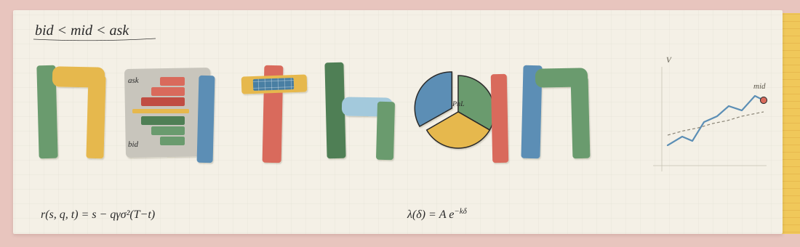

<!-- © Nathan Punyataweekul · https://github.com/NathanPunya -->

  <picture>
    <source media="(prefers-color-scheme: dark)" srcset="assets/banner-dark.svg">
    
  </picture>

  <picture>
    <source media="(prefers-color-scheme: dark)" srcset="https://visitor-badge.laobi.icu/badge?page_id=NathanPunya.NathanPunya&style=flat-square&left_color=%233C3A36&right_color=%23E07A6C">
    
  </picture>

  UCLA CS student building software across full-stack, mobile systems, AI/ML, and trading.

  Welcome to my open source homepage. Reach out on LinkedIn, or look through the work below.

  <picture>
    <source media="(prefers-color-scheme: dark)" srcset="assets/divider-dark.svg">
    
  </picture>

  <picture>
    <source media="(prefers-color-scheme: dark)" srcset="assets/label-featured-dark.svg">
    
  </picture>

- **[LATTICE](https://github.com/NathanPunya/LATTICE)** — Event-driven limit-order-book simulator for market making
- **[Bento](https://github.com/NathanPunya/bento)** — AI benchmarking system for evaluating language models on MMLU
- **[Zones](https://github.com/NathanPunya/Zones)** — Paper.io-inspired competitive running app in Swift
- **[Bruin Hot Takes](https://github.com/NathanPunya/bruin-hot-take)** — Real-time campus discussion platform
- <picture><source media="(prefers-color-scheme: dark)" srcset="assets/google-snake-title-dark.svg"></picture> — GitHub contribution grid replayed on the classic green board, eating commits

  <picture>
    <source media="(prefers-color-scheme: dark)" srcset="assets/stats-dark.svg">
    
  </picture>

  

  <picture>
    <source media="(prefers-color-scheme: dark)" srcset="assets/divider-dark.svg">
    
  </picture>

  <picture>
    <source media="(prefers-color-scheme: dark)" srcset="assets/label-connect-dark.svg">
    
  </picture>

  <a href="https://github.com/NathanPunya">
    <picture>
      <source media="(prefers-color-scheme: dark)" srcset="assets/btn-github-dark.svg">
      
    </picture>
  </a>
  &nbsp;&nbsp;
  <a href="https://www.linkedin.com/in/nathan-punyataweekul">
    <picture>
      <source media="(prefers-color-scheme: dark)" srcset="assets/btn-linkedin-dark.svg">
      
    </picture>
  </a>

  <picture>
    <source media="(prefers-color-scheme: dark)" srcset="assets/label-tools-dark.svg">
    
  </picture>

  
  
  
  
  
  
  
  
  
  
  
  
  
  

  <picture>
    <source media="(prefers-color-scheme: dark)" srcset="assets/divider-dark.svg">
    
  </picture>

  For a more immersive portfolio, check out <a href="https://nathanpunya.github.io/">my website</a>.

